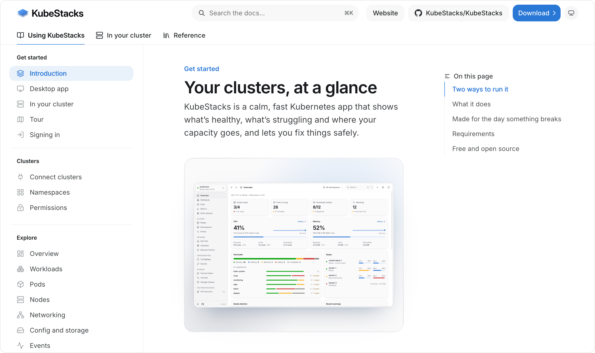

<div align="center">


# Lumovi docs

**The documentation for [Lumovi](https://github.com/Lumovi/Lumovi), at
[docs.lumovi.dev](https://docs.lumovi.dev).**

Installing it, using it, running it for your team, and every setting: the source of the docs
for the calm, fast Kubernetes dashboard, on your desktop or in your cluster.

[](https://github.com/Lumovi/Lumovi-docs/actions/workflows/ci.yml)
[](https://docs.lumovi.dev)
[](LICENSE)

</div>

<a href="https://docs.lumovi.dev">
  <picture>
    <source media="(prefers-color-scheme: dark)" srcset=".github/assets/docs-dark.png" />
    
  </picture>
</a>

## What's in it

| Section                                                               | Folder              | What it covers                                                          |
| --------------------------------------------------------------------- | ------------------- | ----------------------------------------------------------------------- |
| [Get started](https://docs.lumovi.dev)                                | `get-started/`      | The desktop app, Lumovi in your cluster, a tour, and signing in         |
| [Clusters](https://docs.lumovi.dev/clusters/connect)                  | `clusters/`         | Kubeconfigs, namespaces, and the permissions each feature needs         |
| [Explore](https://docs.lumovi.dev/explore/overview)                   | `explore/`          | The overview, every list, the detail panel, health, and finding things  |
| [Make changes](https://docs.lumovi.dev/changes/safely)                | `changes/`          | Actions, YAML, creating objects, bulk changes and the guard rails       |
| [Debug](https://docs.lumovi.dev/debug/logs)                           | `debug/`            | Logs, shells, debug containers and port forwards                        |
| [Metrics](https://docs.lumovi.dev/metrics/live-usage)                 | `metrics/`          | Live usage, and usage history from Prometheus or VictoriaMetrics        |
| [Helm](https://docs.lumovi.dev/helm/releases)                         | `helm/`             | Releases, upgrades and rollbacks, installs, and charts on your computer |
| [Custom resources](https://docs.lumovi.dev/custom-resources/overview) | `custom-resources/` | Every kind the cluster serves, built-in views, and writing your own     |
| [In your cluster](https://docs.lumovi.dev/server/overview)            | `server/`           | Installing the chart, sign-in, security, and every setting              |
| [Reference](https://docs.lumovi.dev/reference/keyboard-shortcuts)     | `reference/`        | Shortcuts, the view format, kinds, troubleshooting and the FAQ          |

The site is built with [Mintlify](https://mintlify.com). Besides the pages:

| File                             | What it does                                                                                           |
| -------------------------------- | ------------------------------------------------------------------------------------------------------ |
| `docs.json`                      | Navigation, theme, colors, and the current Lumovi version (`{{version}}`)                              |
| `style.css`                      | Lumovi's own look: its colors, key caps, screenshots and health labels                                 |
| `logo/`, `favicon.svg`, `og.png` | Lumovi's logo, favicon and link preview, from [Lumovi-design](https://github.com/Lumovi/Lumovi-design) |
| `screenshots.js`                 | Shows screenshots at full size when one is zoomed                                                      |
| `.github/scripts/check.mjs`      | Checks what Mintlify doesn't: screenshots, icons, page metadata and variables                          |

Screenshots aren't kept here. Lumovi takes them of its demo clusters, in light and dark,
and the pages show them straight from
[its repository](https://github.com/Lumovi/Lumovi/tree/main/docs/screenshots), so the
docs always show the app as it is.

## Running it locally

You need [Node.js](https://nodejs.org) 20 or later.

```sh
npx mint dev                    # the docs at http://localhost:3000, reloading as you edit
npx mint validate               # fails on any build warning or error
npx mint broken-links           # every link between pages
node .github/scripts/check.mjs  # screenshots, icons, page metadata and variables
```

CI runs the last three on every pull request. What's merged to `main` goes live at
[docs.lumovi.dev](https://docs.lumovi.dev).

## Contributing

Fixes and improvements are welcome, from a typo to a new page. [CONTRIBUTING.md](CONTRIBUTING.md)
covers how pages are written, where screenshots come from, and what to check before you open a
pull request. To report something wrong in the docs, open an
[issue](https://github.com/Lumovi/Lumovi-docs/issues/new/choose). Bugs and ideas for
the app itself go to [Lumovi](https://github.com/Lumovi/Lumovi/issues).

## License

[Apache License 2.0](LICENSE), like Lumovi.

<sub>Kubernetes is a registered trademark of the Linux Foundation.</sub>
