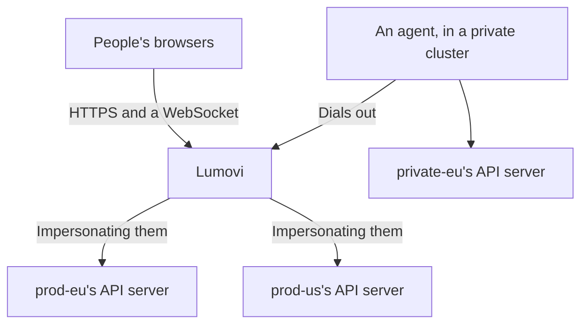

One Lumovi can show many clusters. People sign in once, and its home page sums every cluster up, the ones that need attention first. Each cluster opens to the same pages as a Lumovi of its own, and in each one people see and change what their RBAC there allows.

<Frame caption="A fleet of four clusters: the ones that need attention first.">
  
  
</Frame>

<Columns cols={2}>
  <Card title="Add a cluster" icon="circle-plus" href="/server/fleet/members">
    A service account that may only impersonate, and its token.
  </Card>
  <Card title="Private clusters" icon="radio-tower" href="/server/fleet/agents">
    An agent in the cluster dials Lumovi, when Lumovi can't reach it.
  </Card>
</Columns>

## How it works

Lumovi keeps a list of clusters, with credentials for each that should allow nothing but impersonating people. Every request Lumovi makes to a cluster carries them, with `Impersonate-User` and `Impersonate-Group` headers naming whoever is signed in, so each cluster's API server applies that person's RBAC. Someone with no role in a cluster sees nothing in it. On clusters that trust your identity provider, requests can carry each person's own token instead: see [Sign-in](#sign-in).



Clusters come from:

- **A kubeconfig**, each of whose contexts is a cluster: in a setting, or in files Lumovi reads again as they change. See [Describe the clusters](#describe-the-clusters).
- **Secrets** of the cluster Lumovi runs in: its own, Cluster API's and Argo CD's. See [Clusters from Secrets](/server/fleet/discovery).
- **Agents**, for clusters Lumovi can't reach: each dials Lumovi from inside its cluster. See [Private clusters](/server/fleet/agents).
- **The cluster Lumovi runs in**, if it runs in one. See [The cluster it runs in](#the-cluster-it-runs-in).

## Sign-in

A fleet needs [single sign-on](/server/auth/single-sign-on) or an [authenticating proxy](/server/auth/proxy). A token says who someone is to one cluster only, so with token sign-in (the default) a fleet doesn't start:

```text
A fleet needs single sign-on or a proxy (LUMOVI_AUTH=oidc or proxy): a pasted token only says who someone is to one cluster.
```

The Helm chart refuses to install a fleet with `auth.mode: token`, for the same reason.

People sign in once, to Lumovi. Their names and groups come from your provider or proxy, and Lumovi uses them in every cluster. `LUMOVI_USERNAME_PREFIX` and `LUMOVI_GROUPS_PREFIX` (the chart's `auth.usernamePrefix` and `auth.groupsPrefix`) apply in every cluster too, unless a cluster sets [its own](#settings-for-each-cluster). Lumovi never acts as one of Kubernetes' own users or groups (`system:…`) in any of them. It leaves out groups whose names, with a cluster's prefix, would start with `system:`. Someone whose name would, with the server's prefix, can't sign in. With a cluster's own prefix, that cluster's card says why it can't be used.

When some of your API servers trust your provider themselves, Lumovi can pass people's own tokens on to those: set `LUMOVI_OIDC_FORWARD_TOKEN` (the chart's `auth.oidc.forwardToken`), and `forwardToken: true` on those clusters. It impersonates people in the others, and always in the cluster it runs in.

- **A cluster that refuses someone's token** says **Unauthorized** on its card. They stay signed in, and the other clusters work: in a fleet, one cluster refusing a token doesn't end the session, as it does in a Lumovi of one cluster.
- **Behind a proxy**, Lumovi has no tokens to pass on, so a cluster with `forwardToken: true` can't be used. Its card says why.

## Where it runs

Lumovi doesn't need to run in Kubernetes to show a fleet. It needs to reach each cluster's API server, or each cluster's agent needs to reach it.

| Where | How | Clusters from |
| --- | --- | --- |
| A cluster | The Helm chart, with its [`fleet` values](/server/helm-values#a-fleet) | A kubeconfig in a Secret, Secrets, agents, and the cluster itself |
| A machine of its own | [Docker](#with-docker), with a kubeconfig in a folder | A kubeconfig, and agents |
| A platform like Sevalla | [Environment variables only](/server/fleet/sevalla) | A kubeconfig in a variable, and agents |

Run one Lumovi, with one replica. Sessions live in its memory, and each agent connects to one Lumovi. With single sign-on, restarting it, as an upgrade does, signs everyone out. Its agents connect again by themselves.

## Describe the clusters

Give Lumovi a kubeconfig. Each context is a cluster, called by the context's name: in Lumovi's pages, their addresses and titles. Its user is how Lumovi signs in there: a token or a client certificate that may impersonate users and groups, and nothing more. [Add a cluster](/server/fleet/members) makes one, and prints the kubeconfig to add.

```yaml fleet.yaml
apiVersion: v1
kind: Config
clusters:
  - name: prod-eu
    cluster:
      server: https://prod-eu.example.com:6443
      certificate-authority-data: LS0tLS1CRUdJTi…
  - name: staging
    cluster:
      server: https://staging.example.com:6443
      certificate-authority-data: LS0tLS1CRUdJTi…
users:
  - name: prod-eu
    user:
      token: eyJhbGciOiJSUzI1NiIs…
  - name: staging
    user:
      token: eyJhbGciOiJSUzI1NiIs…
contexts:
  - name: prod-eu
    context:
      cluster: prod-eu
      user: prod-eu
      extensions:
        - name: lumovi.dev
          extension:
            labels: { env: production, region: eu-west }
  - name: staging
    context:
      cluster: staging
      user: staging
      extensions:
        - name: lumovi.dev
          extension:
            labels: { env: staging, region: eu-west }
            groups: [developers, sre]
```

Give it to Lumovi in one of two settings:

- **`LUMOVI_FLEET_KUBECONFIG`**: the kubeconfig itself, as YAML or JSON, or that encoded in base64 on one line, for platforms whose settings take one line. Lumovi reads it when it starts, and one that isn't a kubeconfig stops it. To change it, change the setting and restart Lumovi.
- **`LUMOVI_FLEET_KUBECONFIG_FILE`**: one or more files, separated by `:`. Lumovi reads them when it starts, and again every 30 seconds (`LUMOVI_FLEET_REFRESH_SECONDS`), so you can add and remove clusters without restarting it. Relative paths in a file are read from that file's folder.

You can use both. A file that can't be read, or isn't a kubeconfig, keeps the clusters it had (none, if it couldn't be read when Lumovi started), and the log says why, once:

```text
Fleet: /etc/lumovi/fleet/kubeconfig can't be read: /etc/lumovi/fleet/kubeconfig isn't a kubeconfig: …
```

<Warning>
  The image has only Node.js and helm, so credential plugins like `aws eks get-token`, `gke-gcloud-auth-plugin` or `kubelogin` aren't in it. Give each cluster a token or a client certificate.
</Warning>

### Settings for each cluster

Each context can have Lumovi's settings for its cluster, in an extension called `lumovi.dev`. Every one is optional.

<ResponseField name="labels" type="object">
  The cluster's labels, like `{ env: production, region: eu-west }`, each a piece of text (quote numbers: `tier: '1'`). The fleet page filters and groups clusters by them.
</ResponseField>

<ResponseField name="groups" type="string[]">
  Only people in one of these groups see the cluster, in the fleet page or anywhere else in Lumovi: groups as your provider or proxy names them, without prefixes. Without it, everyone signed in does, and an empty list hides it from everyone. It decides what Lumovi shows, not what people may do: RBAC still decides that.
</ResponseField>

<ResponseField name="forwardToken" type="boolean" default="false">
  `true`: requests carry each person's own token, for an API server that trusts your provider, instead of impersonating them. Lumovi must have their tokens: set `LUMOVI_OIDC_FORWARD_TOKEN`. The context's user can then have no credentials at all.
</ResponseField>

<ResponseField name="usernamePrefix" type="string">
  Put before the names of the users Lumovi impersonates here, instead of `LUMOVI_USERNAME_PREFIX`. `''` puts nothing before them here.
</ResponseField>

<ResponseField name="groupsPrefix" type="string">
  Put before the names of their groups here, instead of `LUMOVI_GROUPS_PREFIX`. Each prefix a cluster doesn't set is the server's.
</ResponseField>

```yaml fleet.yaml
contexts:
  - name: prod-eu
    context:
      cluster: prod-eu
      user: prod-eu
      extensions:
        - name: lumovi.dev
          extension:
            labels: { env: production, tier: '1' }
            groups: [sre]
            # As this cluster's role bindings name people and groups.
            usernamePrefix: 'corp:'
            groupsPrefix: 'corp:'
```

A context whose extension isn't like this is shown as **Misconfigured**, saying why, like `Its lumovi.dev extension: forwardToken must be true or false.` The other clusters work.

Only a kubeconfig's contexts have this extension, including those in [Lumovi's own Secrets](/server/fleet/discovery). Secrets give clusters labels, groups and `forwardToken` in annotations, and [agents](/server/fleet/agents) in Lumovi's list of them. Clusters from Cluster API's and Argo CD's Secrets, agents' clusters and the cluster Lumovi runs in all take the server's prefixes.

### The cluster it runs in

In a cluster, Lumovi includes that cluster in its fleet, as `in-cluster` unless `LUMOVI_CLUSTER_NAME` (the chart's `clusterName`) names it, with the labels in `LUMOVI_CLUSTER_LABELS` (`env=production,region=eu-west`, the chart's `fleet.labels`). Everyone signed in sees it.

It reaches it with its pod's service account, impersonating people even where it passes tokens on to other clusters, so the service account needs to impersonate users and groups. The chart lets it, unless `fleet.includeThisCluster` is `false`.

It's in the fleet whenever Lumovi runs in a cluster, unless `LUMOVI_FLEET_LOCAL=false` leaves it out. `LUMOVI_FLEET_LOCAL=true` on its own makes a fleet of just that cluster, and outside a cluster stops Lumovi.

### With Helm

Put the kubeconfig in a Secret, under `kubeconfig`, in Lumovi's namespace:

```bash
kubectl create secret generic lumovi-fleet --namespace lumovi \
  --from-file kubeconfig=fleet.yaml
```

Then name it in your values, with single sign-on or a proxy:

```yaml values.yaml
clusterName: hub
url: https://lumovi.example.com
auth:
  mode: oidc
  oidc:
    issuer: https://login.example.com
    clientId: lumovi
    existingSecret: lumovi-sso
  usernamePrefix: 'oidc:'
  groupsPrefix: 'oidc:'
fleet:
  kubeconfigSecret: lumovi-fleet
  # The cluster Lumovi runs in, as "hub", with these labels.
  includeThisCluster: true
  labels:
    env: production
```

The chart mounts the Secret's `kubeconfig` at `/etc/lumovi/fleet/kubeconfig`, so the pod doesn't start until the Secret is there, with that key. Kubernetes updates the mounted file when the Secret changes, and Lumovi reads it again, so a cluster you add appears within a minute or two. The chart's notes, after installing, start with `Lumovi shows a fleet of clusters to whoever signs in, hub among them.` Every fleet value is in [Helm values](/server/helm-values#a-fleet).

### With Docker

Keep the kubeconfig in a folder, and mount the folder (a file mounted on its own isn't updated when an editor replaces it):

```bash
docker run -d --restart unless-stopped -p 8080:8080 \
  -v "$PWD/fleet:/etc/lumovi/fleet:ro" \
  -e LUMOVI_FLEET_KUBECONFIG_FILE=/etc/lumovi/fleet/kubeconfig \
  -e LUMOVI_URL=https://lumovi.example.com \
  -e LUMOVI_AUTH=oidc \
  -e LUMOVI_OIDC_ISSUER=https://login.example.com \
  -e LUMOVI_OIDC_CLIENT_ID=lumovi \
  -e LUMOVI_OIDC_CLIENT_SECRET \
  -e LUMOVI_USERNAME_PREFIX=oidc: \
  -e LUMOVI_GROUPS_PREFIX=oidc: \
  ghcr.io/lumovi/lumovi:{{version}}
```

The image runs as user 65532, which must be able to read the file. Put TLS in front of Lumovi with a reverse proxy, and set `LUMOVI_URL` to the address people open. See [Run it without Kubernetes](/server/docker).

## The fleet page

Lumovi's home page is the fleet: every cluster the person signed in may see, as a card that sums it up the way its overview does. What people see on it, and how they move between clusters, is in [Clusters in a fleet](/clusters/fleet). For whoever runs Lumovi:

- **Each cluster is asked as the person**, every 30 seconds while the page is open. A count they may not list says **No access**, and a cluster where they may list none of its nodes, pods and workloads isn't said to be healthy.
- **Filters**: the chips are **All**, **Needs attention**, **Healthy** and **Unreachable** (clusters that didn't answer, or can't be used), and a chip with no clusters is hidden. Clusters still being checked, and those the person has no access to, are only under **All**. People also pick labels, search by name or label (<kbd>/</kbd> or <kbd>⌘</kbd><kbd>K</kbd> goes to the search; ⌘ is Ctrl on Windows and Linux) and group the cards by a label's values. All of these are in the page's address, so a link keeps them.
- **Find a workload** searches the Deployments, StatefulSets, DaemonSets and CronJobs of every cluster that answered, by name or namespace, and lists the first 50: move to one with <kbd>↑</kbd> <kbd>↓</kbd> and press <kbd>↵</kbd> to open it in its cluster. It lists each kind in the whole cluster, as the person, so it finds nothing in a cluster where they may only list workloads in some namespaces.
- **Someone who may see none of the clusters** gets **No clusters for you here**, and is asked to have whoever runs Lumovi add one, or share one with their groups.

A card says the first of these that applies:

| Status | When |
| --- | --- |
| <span className="lumovi-status critical">Unreachable</span>, <span className="lumovi-status critical">Unauthorized</span>, <span className="lumovi-status critical">Misconfigured</span>… | It didn't answer, refused Lumovi, or can't be used. The card says why. |
| <span className="lumovi-status neutral">No access</span> | The person may list none of its nodes, pods and workloads, so Lumovi can't say. |
| <span className="lumovi-status critical">2 nodes not ready</span> | Some of its nodes aren't ready. |
| <span className="lumovi-status warning">3 workloads degraded</span> | Some Deployments, StatefulSets or DaemonSets have fewer replicas ready than they want (scaled to zero is fine). |
| <span className="lumovi-status warning">8 pods unhealthy</span> | Some pods are failing, pending, not ready or terminating: see [Health](/explore/health). |
| <span className="lumovi-status healthy">Healthy</span> | None of the above. |

Until a cluster answers, its card says <span className="lumovi-status progressing">Checking…</span>. The cards that need attention come first, critical before warning, then those still being checked, the healthy ones, and last those the person has no access to, each in order of name. Warning events are counted on each card, but don't make a cluster need attention: every cluster has some.

<Frame caption="Finding a workload in every cluster.">
  
  
</Frame>

Opening a card opens the cluster, with the same pages as a Lumovi of its own. The cluster's name at the top of the sidebar switches to another cluster, and **All clusters** there leads back to the fleet, as it does on the banner of a cluster that stops answering. The command palette has both too.

- **Read-only**: each person can make a cluster read-only for themselves, in their browser. `readOnly: true` (`LUMOVI_READ_ONLY`) makes every cluster read-only for everyone.
- **Usage history** comes from `metrics.source` (`LUMOVI_METRICS_SOURCE`) in every cluster, unless people choose another source for one. In a fleet, leave it `auto`, so Lumovi looks in each cluster, unless they all have the same service.
- **Views and add-ons** everyone sees are the server's, for every cluster: see [Views for everyone](/server/views).

## When a cluster can't be used

Its card says why, and so does opening it. These are about Lumovi's settings rather than the cluster:

| What it says | On its card | Why |
| --- | --- | --- |
| Its kubeconfig names a cluster it doesn't have. | **Misconfigured** | The context's `cluster` isn't one of the kubeconfig's clusters. |
| Lumovi has no credentials for it: give its user a token or a client certificate, or set forwardToken to pass on each person's own. | **Misconfigured** | The context's user has nothing to sign in with, or the kubeconfig has no such user. |
| Its lumovi.dev extension: … | **Misconfigured** | Lumovi's [settings for it](#settings-for-each-cluster) aren't as they should be. |
| It takes each person's own token, and this server doesn't pass tokens on: set LUMOVI_OIDC_FORWARD_TOKEN. | **Credentials failed** | The cluster has `forwardToken: true`, and Lumovi has no tokens to pass on. |
| Lumovi doesn't act as system:…: names starting with system: are Kubernetes' own. | **Forbidden** | With the cluster's prefix, the person's name would be one of Kubernetes' own. |
| Its agent isn't connected. | **Unreachable** | The cluster comes from an [agent](/server/fleet/agents) that isn't connected now. |

A Secret that doesn't describe a cluster as it should is shown under the Secret's name, as **Misconfigured**: see [Clusters from Secrets](/server/fleet/discovery). Anything else is the cluster's own answer, as it would be on the desktop: **Unreachable**, **Timed out**, **Certificate error**, **Unauthorized** and the rest. See [Troubleshooting](/reference/troubleshooting).

A cluster someone can't see, because of its `groups`, isn't there for them: its address says `This server has no cluster called "staging" that you can see.`

Lumovi's log says when clusters come and go (`Fleet: staging added`, `Fleet: staging removed`; when it starts, every cluster is added), and says each problem with a source once, until it changes. Two clusters can't have the same name: the first one stays, and the log says which was left out:

```text
Fleet: Two clusters are called staging: the one from Secret lumovi/staging is left out (the one from LUMOVI_FLEET_KUBECONFIG stays).
```

`LUMOVI_FLEET_KUBECONFIG` comes first, then the cluster Lumovi runs in, the files in `LUMOVI_FLEET_KUBECONFIG_FILE`, Secrets, and agents last.

## AI assistants

People's [AI assistants](/assistants/server) sign in to the fleet's Lumovi, and act as them in every cluster they may see, as Lumovi does for them. Give some clusters a rule of their own for what assistants' changes do, by the clusters' names, like `ask,staging=allow,production=never`. See [AI assistants for your team](/server/assistants#in-a-fleet).

## Helm

Helm runs on Lumovi's machine, with the helm in Lumovi's image, once for each change. Each run gets a kubeconfig of its own for the cluster it changes, acting as the person who made it there: impersonating them with Lumovi's credentials for that cluster, or with their own token where the cluster takes it. For a cluster behind an agent, Lumovi opens a port on `127.0.0.1` that leads through the agent while helm runs, and closes it after.

## Security

A fleet's Lumovi holds credentials that may impersonate anyone in every cluster it shows. Whoever controls it, or reads its kubeconfig, controls them all. Treat it like the most trusted of your clusters:

- **Give it credentials that may only impersonate.** [Add a cluster](/server/fleet/members) makes a service account that may do nothing else, so Lumovi acts only as the people who sign in.
- **Keep its kubeconfig secret**, in a Secret or a setting only its administrators can read, and its agents' tokens in their own clusters.
- **Use prefixes**, so no name or group from your provider or proxy is one of a cluster's own by accident.
- **Behind a proxy, let nothing else reach Lumovi.** It trusts the proxy's headers completely.

See [A fleet](/server/security#a-fleet) in Security for what Lumovi holds, and what agents can and can't see.

<Columns cols={2}>
  <Card title="Add a cluster" icon="circle-plus" href="/server/fleet/members">
    Its service account, its token, and the kubeconfig to add.
  </Card>
  <Card title="On Sevalla" icon="cloud" href="/server/fleet/sevalla">
    A fleet without Kubernetes, from environment variables.
  </Card>
</Columns>
