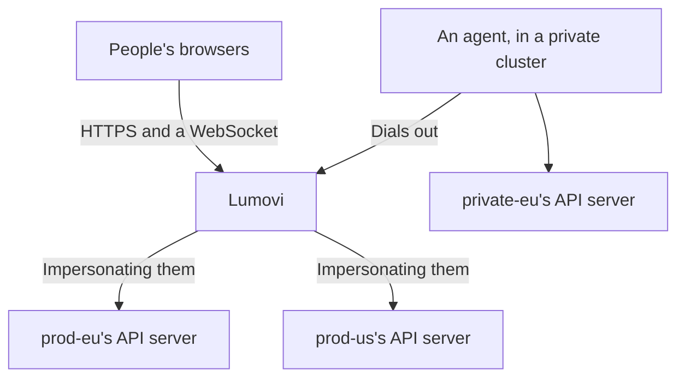

One Lumovi can show many clusters. People sign in once, and its home page sums every cluster up, the ones that need attention first. Each cluster opens to the same pages as a Lumovi of its own, and in each one people see and change what their RBAC there allows.

<Frame caption="A fleet of four clusters: the ones that need attention first.">
  
  
</Frame>

<Columns cols={2}>
  <Card title="Add a cluster" icon="circle-plus" href="/server/fleet/members">
    A service account that may only impersonate, and its token.
  </Card>
  <Card title="Private clusters" icon="radio-tower" href="/server/fleet/agents">
    An agent in the cluster dials Lumovi, when Lumovi can't reach it.
  </Card>
</Columns>

## How it works

Lumovi keeps a list of clusters, with credentials for each that should allow nothing but impersonating people. Every request Lumovi makes to a cluster carries them, with `Impersonate-User` and `Impersonate-Group` headers naming whoever is signed in, so each cluster's API server applies that person's RBAC. Someone with no role in a cluster sees nothing in it.



Clusters come from:

- **A kubeconfig**, each of whose contexts is a cluster: in a setting, or in files Lumovi reads again as they change. See [Describe the clusters](#describe-the-clusters).
- **Secrets** of the cluster Lumovi runs in: its own, Cluster API's and Argo CD's. See [Clusters from Secrets](/server/fleet/discovery).
- **Agents**, for clusters Lumovi can't reach: each dials Lumovi from inside its cluster. See [Private clusters](/server/fleet/agents).
- **The cluster Lumovi runs in**, if it runs in one. See [The cluster it runs in](#the-cluster-it-runs-in).

## Sign-in

A fleet needs [single sign-on](/server/auth/single-sign-on) or an [authenticating proxy](/server/auth/proxy). A token says who someone is to one cluster only, so with token sign-in (the default) a fleet doesn't start:

```text
A fleet needs single sign-on or a proxy (LUMOVI_AUTH=oidc or proxy): a pasted token only says who someone is to one cluster.
```

People's names and groups come from your provider or proxy, and Lumovi uses them in every cluster. `LUMOVI_USERNAME_PREFIX` and `LUMOVI_GROUPS_PREFIX` apply in every cluster too, unless a cluster sets [its own](#settings-for-each-cluster). Lumovi never acts as one of Kubernetes' own users or groups (`system:…`) in any of them.

When some of your API servers trust your provider themselves, Lumovi can pass people's own tokens on to those: set `LUMOVI_OIDC_FORWARD_TOKEN`, and `forwardToken: true` on those clusters. It impersonates people in the others.

## Where it runs

Lumovi doesn't need to run in Kubernetes to show a fleet. It needs to reach each cluster's API server, or each cluster's agent needs to reach it.

| Where | How | Clusters from |
| --- | --- | --- |
| A cluster | The Helm chart, with its [`fleet` values](/server/helm-values#a-fleet) | A kubeconfig in a Secret, Secrets, agents, and the cluster itself |
| A machine of its own | [Docker](#with-docker), with a kubeconfig in a folder | A kubeconfig, and agents |
| A platform like Sevalla | [Environment variables only](/server/fleet/sevalla) | A kubeconfig in a variable, and agents |

Run one Lumovi, with one replica. Sessions live in its memory, and each agent connects to one Lumovi.

## Describe the clusters

Give Lumovi a kubeconfig. Each context is a cluster, called by the context's name: in Lumovi's pages, their addresses and titles. Its user is how Lumovi signs in there: a token or a client certificate that may impersonate users and groups, and nothing more. [Add a cluster](/server/fleet/members) makes one, and prints the kubeconfig to add.

```yaml fleet.yaml
apiVersion: v1
kind: Config
clusters:
  - name: prod-eu
    cluster:
      server: https://prod-eu.example.com:6443
      certificate-authority-data: LS0tLS1CRUdJTi…
  - name: staging
    cluster:
      server: https://staging.example.com:6443
      certificate-authority-data: LS0tLS1CRUdJTi…
users:
  - name: prod-eu
    user:
      token: eyJhbGciOiJSUzI1NiIs…
  - name: staging
    user:
      token: eyJhbGciOiJSUzI1NiIs…
contexts:
  - name: prod-eu
    context:
      cluster: prod-eu
      user: prod-eu
      extensions:
        - name: lumovi.dev
          extension:
            labels: { env: production, region: eu-west }
  - name: staging
    context:
      cluster: staging
      user: staging
      extensions:
        - name: lumovi.dev
          extension:
            labels: { env: staging, region: eu-west }
            groups: [developers, sre]
```

Give it to Lumovi in one of two settings:

- **`LUMOVI_FLEET_KUBECONFIG`**: the kubeconfig itself, as YAML or JSON, or that encoded in base64 on one line, for platforms whose settings take one line. Lumovi reads it when it starts, and one that isn't a kubeconfig stops it.
- **`LUMOVI_FLEET_KUBECONFIG_FILE`**: one or more files, separated by `:`. Lumovi reads them when it starts, and again every 30 seconds (`LUMOVI_FLEET_REFRESH_SECONDS`), so you can add and remove clusters without restarting it. Relative paths in a file are read from that file's folder.

A file that can't be read, or isn't a kubeconfig, keeps the clusters it had, and the log says why, once:

```text
Fleet: /etc/lumovi/fleet/kubeconfig can't be read: /etc/lumovi/fleet/kubeconfig isn't a kubeconfig: …
```

<Warning>
  The image has only Node.js and helm, so credential plugins like `aws eks get-token`, `gke-gcloud-auth-plugin` or `kubelogin` aren't in it. Give each cluster a token or a client certificate.
</Warning>

### Settings for each cluster

Each context can have Lumovi's settings for its cluster, in an extension called `lumovi.dev`. Every one is optional.

<ResponseField name="labels" type="object">
  The cluster's labels, like `{ env: production, region: eu-west }`, each a piece of text. The fleet page filters and groups clusters by them.
</ResponseField>

<ResponseField name="groups" type="string[]">
  Only people in one of these groups see the cluster, in the fleet page or anywhere else in Lumovi: groups as your provider or proxy names them, without prefixes. Without it, everyone signed in does. It decides what Lumovi shows, not what people may do: RBAC still decides that.
</ResponseField>

<ResponseField name="forwardToken" type="boolean" default="false">
  `true`: requests carry each person's own token, for an API server that trusts your provider, instead of impersonating them. Lumovi must have their tokens: set `LUMOVI_OIDC_FORWARD_TOKEN`. The context's user can then have no credentials at all.
</ResponseField>

<ResponseField name="usernamePrefix" type="string">
  Put before the names of the users Lumovi impersonates here, instead of `LUMOVI_USERNAME_PREFIX`.
</ResponseField>

<ResponseField name="groupsPrefix" type="string">
  Put before the names of their groups here, instead of `LUMOVI_GROUPS_PREFIX`. Each prefix a cluster doesn't set is the server's.
</ResponseField>

A context whose extension isn't like this is shown as **Misconfigured**, saying why, like `Its lumovi.dev extension: forwardToken must be true or false.` The other clusters work.

### The cluster it runs in

In a cluster, Lumovi includes that cluster in its fleet, as `in-cluster` unless `LUMOVI_CLUSTER_NAME` names it, with the labels in `LUMOVI_CLUSTER_LABELS` (`env=production,region=eu-west`). It reaches it with its pod's service account, which then needs to impersonate users and groups. `LUMOVI_FLEET_LOCAL=false` leaves it out. `LUMOVI_FLEET_LOCAL=true` on its own makes a fleet of just that cluster.

### With Helm

Put the kubeconfig in a Secret, under `kubeconfig`, in Lumovi's namespace:

```bash
kubectl create secret generic lumovi-fleet --namespace lumovi \
  --from-file kubeconfig=fleet.yaml
```

Then name it in your values, with single sign-on or a proxy:

```yaml values.yaml
clusterName: hub
url: https://lumovi.example.com
auth:
  mode: oidc
  oidc:
    issuer: https://login.example.com
    clientId: lumovi
    existingSecret: lumovi-sso
  usernamePrefix: 'oidc:'
  groupsPrefix: 'oidc:'
fleet:
  kubeconfigSecret: lumovi-fleet
  # The cluster Lumovi runs in, as "hub", with these labels.
  includeThisCluster: true
  labels:
    env: production
```

Kubernetes updates the mounted Secret when it changes, and Lumovi reads it again, so a cluster you add appears within a minute or two. Every fleet value is in [Helm values](/server/helm-values#a-fleet).

### With Docker

Keep the kubeconfig in a folder, and mount the folder (a file mounted on its own isn't updated when an editor replaces it):

```bash
docker run -d --restart unless-stopped -p 8080:8080 \
  -v "$PWD/fleet:/etc/lumovi/fleet:ro" \
  -e LUMOVI_FLEET_KUBECONFIG_FILE=/etc/lumovi/fleet/kubeconfig \
  -e LUMOVI_URL=https://lumovi.example.com \
  -e LUMOVI_AUTH=oidc \
  -e LUMOVI_OIDC_ISSUER=https://login.example.com \
  -e LUMOVI_OIDC_CLIENT_ID=lumovi \
  -e LUMOVI_OIDC_CLIENT_SECRET \
  -e LUMOVI_USERNAME_PREFIX=oidc: \
  -e LUMOVI_GROUPS_PREFIX=oidc: \
  ghcr.io/lumovi/lumovi:{{version}}
```

The image runs as user 65532, which must be able to read the file. Put TLS in front of Lumovi with a reverse proxy, and set `LUMOVI_URL` to the address people open. See [Run it without Kubernetes](/server/docker).

## The fleet page

Lumovi's home page is the fleet: every cluster the person signed in may see, as a card that sums it up the way its overview does. It checks every cluster again every 30 seconds while it's open.

- **The headline** says how many clusters there are, and how many need attention.
- **Each card** has the cluster's status, its Kubernetes version and how long it took to answer, its labels, its nodes that are ready, its pods running and unhealthy, its healthy workloads (Deployments, StatefulSets and DaemonSets), its warning events in the last hour, and its CPU and memory in use against what its nodes can allocate (with metrics-server). A count the person may not list says **No access**.
- **Filters**: **Needs attention**, **Healthy** and **Unreachable** (clusters that didn't answer), each with how many clusters it has. Pick labels to see the clusters that have all of them, search by name or label, and group the cards by a label's values with **Group by**. All of these are in the page's address, so a link keeps them.
- **Find a workload**, in the toolbar, opens a search through every cluster that answered: type two letters or more of a name or namespace, and Lumovi lists the Deployments, StatefulSets, DaemonSets and CronJobs that match, each with its status and its cluster (the first 50). Choose one, or move to it with the arrow keys and press <kbd>Enter</kbd>, to open it in its cluster.

Cards are in this order, the ones that need attention first:

| Status | When |
| --- | --- |
| Why it didn't answer | It couldn't be reached, refused Lumovi, or can't be used: **Unreachable**, **Unauthorized**, **Misconfigured**… The card says why. |
| *N* nodes not ready | Some of its nodes aren't ready. |
| *N* workloads degraded | Some Deployments, StatefulSets or DaemonSets have fewer replicas ready than they want (scaled to zero is fine). |
| *N* pods unhealthy | Some pods are failing, pending, not ready or terminating: see [Health](/explore/health). |
| Checking… | It hasn't answered yet. |
| Healthy | None of the above. |
| No access | The person may list none of its nodes, pods and workloads, so Lumovi can't say. |

Warning events are counted on each card, but don't make a cluster need attention: every cluster has some.

<Frame caption="Finding a workload in every cluster.">
  
  
</Frame>

Opening a card opens the cluster, with the same pages as a Lumovi of its own. The cluster's name at the top of the sidebar switches to another cluster, and **All clusters** there leads back to the fleet, as it does on the banner of a cluster that stops answering. The command palette (<kbd>⌘</kbd><kbd>K</kbd>) has both too. Each person can make a cluster read-only for themselves, in their browser.

## When a cluster can't be used

Its card says why, and so does opening it. These are about Lumovi's settings rather than the cluster:

| What it says | Why |
| --- | --- |
| Its kubeconfig names a cluster it doesn't have. | The context's `cluster` isn't one of the kubeconfig's clusters. |
| Lumovi has no credentials for it: give its user a token or a client certificate, or set forwardToken to pass on each person's own. | The context's user has nothing to sign in with. |
| Its lumovi.dev extension: … | Lumovi's [settings for it](#settings-for-each-cluster) aren't as they should be. |
| It takes each person's own token, and this server doesn't pass tokens on: set LUMOVI_OIDC_FORWARD_TOKEN. | The cluster has `forwardToken: true`, and Lumovi has no tokens to pass on. |
| Its agent isn't connected. | The cluster comes from an [agent](/server/fleet/agents) that isn't connected now. |
| Lumovi doesn't act as system:…: names starting with system: are Kubernetes' own. | With its prefix, the person's name would be one of Kubernetes' own. |

A cluster someone can't see, because of its `groups`, isn't there for them: its address says `This server has no cluster called "staging" that you can see.`

Lumovi's log says when clusters come and go (`Fleet: staging added`, `Fleet: staging removed`), and says each problem with a source once, until it changes. Two clusters can't have the same name: the first one stays, and the log says which was left out:

```text
Fleet: Two clusters are called staging: the one from Secret lumovi/staging is left out (the one from LUMOVI_FLEET_KUBECONFIG stays).
```

`LUMOVI_FLEET_KUBECONFIG` comes first, then the cluster Lumovi runs in, the files in `LUMOVI_FLEET_KUBECONFIG_FILE`, Secrets, and agents last.

## Helm

Helm runs on Lumovi's machine, once for each change, with a kubeconfig of its own for the cluster it changes, acting as the person who made it, as in a Lumovi of one cluster. For a cluster behind an agent, Lumovi opens a port on `127.0.0.1` that leads through the agent while helm runs, and closes it after.

## Security

A fleet's Lumovi holds credentials that may impersonate anyone in every cluster it shows. Whoever controls it, or reads its kubeconfig, controls them all. Treat it like the most trusted of your clusters:

- **Give it credentials that may only impersonate.** [Add a cluster](/server/fleet/members) makes a service account that may do nothing else, so Lumovi acts only as the people who sign in.
- **Keep its kubeconfig secret**, in a Secret or a setting only its administrators can read.
- **Use prefixes**, so no name or group from your provider or proxy is one of a cluster's own by accident.
- **Behind a proxy, let nothing else reach Lumovi.** It trusts the proxy's headers completely.

See [Security](/server/security) for the rest, which is the same as for one cluster.

<Columns cols={2}>
  <Card title="Add a cluster" icon="circle-plus" href="/server/fleet/members">
    Its service account, its token, and the kubeconfig to add.
  </Card>
  <Card title="On Sevalla" icon="cloud" href="/server/fleet/sevalla">
    A fleet without Kubernetes, from environment variables.
  </Card>
</Columns>
