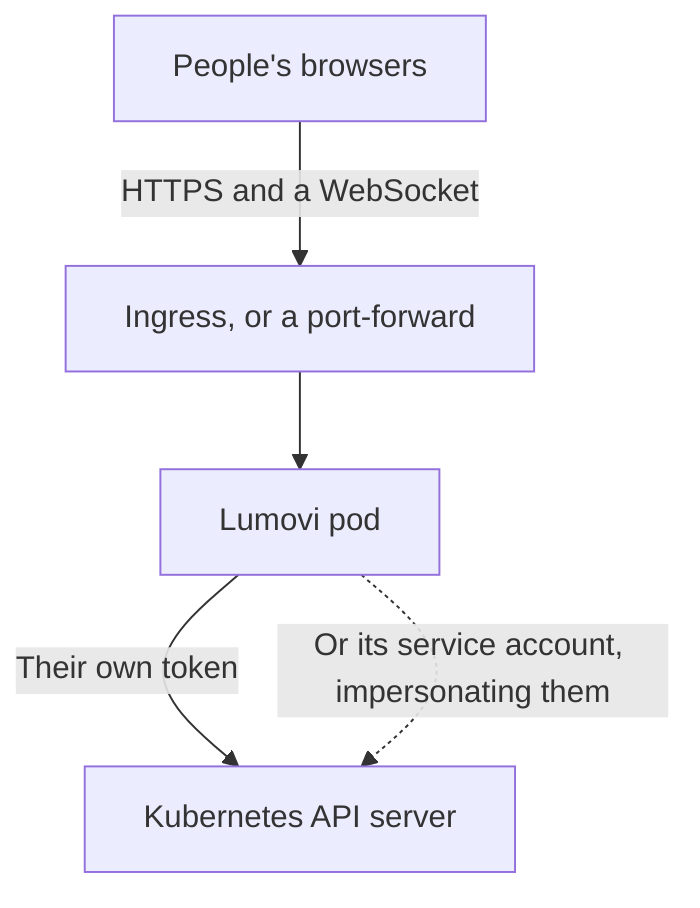

Lumovi runs in a cluster as a dashboard for that cluster. It's the same app as the desktop one, in a browser: people open its address, sign in, and see and change what their own Kubernetes permissions allow. Nobody installs anything, and a link to any page (a pod, its logs, a Helm release) can be shared.

<Frame caption="Lumovi served from a cluster, with the menu of who's signed in open.">
  
  
</Frame>

<Columns cols={2}>
  <Card title="Install it" icon="download" href="/server/install">
    One Helm chart, then a port-forward or an ingress. A few minutes.
  </Card>
  <Card title="Joining a team that runs it?" icon="log-in" href="/get-started/sign-in">
    Nothing to install. Here's how signing in works.
  </Card>
</Columns>

## How it works

Lumovi runs as one pod with a Service in front of it. Each page in a browser keeps one WebSocket open to it, and Lumovi makes every request to the API server as the person who signed in, so the API server applies their RBAC. Lumovi never gives anyone more than their own permissions.

It reaches the API server as that person in one of two ways:

- **With their own token.** Their requests carry a token the cluster checks itself. Lumovi's service account needs no permissions at all.
- **By impersonating them.** Lumovi sends its service account's credentials with `Impersonate-User` and `Impersonate-Group` headers. The API server checks that the service account may impersonate, then applies the person's RBAC.



Which one depends on how people sign in.

## Ways to sign in

| Sign-in | Who says who people are | Lumovi's service account needs | Requests reach the cluster |
| --- | --- | --- | --- |
| [Token](/server/auth/tokens) (the default) | The API server, from the token | No permissions | With the person's token |
| [Single sign-on](/server/auth/single-sign-on) | Your OpenID Connect provider | `impersonate` on users and groups | As the service account, impersonating the person |
| [Single sign-on, tokens passed on](/server/auth/single-sign-on#when-the-api-server-trusts-the-provider) | The API server, which trusts your provider | No permissions | With the person's own token |
| [Authenticating proxy](/server/auth/proxy) | The proxy in front of Lumovi | `impersonate` on users and groups | As the service account, impersonating the person |

When people's own tokens reach the cluster, its audit log names them directly. When Lumovi impersonates them, the audit log records Lumovi's service account acting as them. The chart grants the impersonation permission only in the modes that need it.

A [fleet](/server/fleet) signs people in with single sign-on or a proxy, never with tokens: a token says who someone is to one cluster only. It impersonates people in each cluster, with credentials for that cluster, or passes their own token on to the clusters that trust your provider.

<Note>
  Signing in with a token needs Kubernetes 1.28 or later: Lumovi asks the cluster whose token it is with a SelfSubjectReview. Single sign-on and the proxy work from Kubernetes 1.25, like the rest of Lumovi.
</Note>

## What's different from the desktop app

<AccordionGroup>
  <Accordion title="One cluster, or a fleet" icon="server">
    It shows the cluster it runs in. To show many clusters, with a page that sums them all up and a list to switch between, run it as a [fleet](/server/fleet). A fleet's Lumovi can run in a cluster, on a machine of its own or on a platform like Sevalla, and reaches clusters in private networks through [agents](/server/fleet/agents) that dial out to it.
  </Accordion>
  <Accordion title="No port forwarding" icon="plug">
    There's no computer of the user's to forward a port to, so **Forward a port…** isn't offered. See [Port forwarding](/debug/port-forwarding) for the desktop app.
  </Accordion>
  <Accordion title="No terminals" icon="terminal">
    Terminals run a shell on your own computer, so Lumovi in a cluster has none: no dock, and no **Paste in terminal** by a dialog's command. See [Terminals](/debug/terminal) for the desktop app.
  </Accordion>
  <Accordion title="Charts come from repositories, registries or URLs" icon="package">
    Never from files on anyone's computer. Lumovi fetches charts only from public addresses unless `helm.allowPrivateCharts` allows private ones, such as a ChartMuseum or Harbor in your network. Otherwise anyone signed in could make it reach services inside the cluster's network. See [Security](/server/security#charts-and-private-networks).
  </Accordion>
  <Accordion title="Preferences belong to each browser" icon="globe">
    The theme, whether the cluster is read-only for you, and where your usage history comes from are kept in your browser. Each person can make Lumovi read-only for themselves, and for their AI assistants; `readOnly: true` makes it read-only for everyone.
  </Accordion>
  <Accordion title="AI assistants sign in through Lumovi" icon="sparkles">
    Claude Code, Cursor, VS Code and other assistants connect to Lumovi's address, at `mcp`, and sign in through it in the browser: people allow each one, and it acts as them. The changes they ask for wait on their own pages. Each person says [what theirs may do](/assistants/permissions), and where, within limits the administrator sets. See [AI assistants on a server](/assistants/server), and [AI assistants for your team](/server/assistants) to turn them off or set limits.
  </Accordion>
  <Accordion title="Upgrading Lumovi is upgrading the chart" icon="circle-arrow-up">
    The server doesn't update itself. See [Upgrade](/server/upgrade).
  </Accordion>
  <Accordion title="A few shortcuts belong to the browser" icon="command">
    Keyboard shortcuts are the same, except <kbd>⌘</kbd><kbd>N</kbd> and <kbd>⌘</kbd><kbd>1</kbd>…<kbd>⌘</kbd><kbd>6</kbd> (<kbd>Ctrl</kbd> on Windows and Linux), which browsers keep for themselves. The command palette (<kbd>⌘</kbd><kbd>K</kbd>) has those commands. See [Keyboard shortcuts](/reference/keyboard-shortcuts).
  </Accordion>
</AccordionGroup>

## Pages you can share

In a browser, every page has a real address: a list with its filters and sort order, an object's detail panel, a Helm release. Copy the address bar and send it. Whoever opens it signs in, then lands on the same page, seeing what their own permissions allow.

## The image

<div className="lumovi-facts">
  <div><span className="lumovi-label">Image</span><span className="lumovi-value">ghcr.io/lumovi/lumovi</span></div>
  <div><span className="lumovi-label">Platforms</span><span className="lumovi-value">linux/amd64, linux/arm64</span></div>
  <div><span className="lumovi-label">Runs as</span><span className="lumovi-value">Non-root, no shell</span></div>
  <div><span className="lumovi-label">Writes to</span><span className="lumovi-value">/tmp only</span></div>
</div>

The image has Node.js, helm and Lumovi, and nothing else. When people install, upgrade or roll back a Helm release through Lumovi, it runs that helm (Helm 4.3.0 in Lumovi {{version}}), whatever helm they have on their own computers. Each release is signed with a build provenance attestation, which the [GitHub CLI](https://cli.github.com) checks:

```bash
gh attestation verify oci://ghcr.io/lumovi/lumovi:{{version}} --repo Lumovi/Lumovi
```

The Helm chart is `oci://ghcr.io/lumovi/charts/lumovi`. It's released with Lumovi itself, so the chart's version is the app's, and it's attested the same way: see [Verify the image](/server/install#verify-the-image).

## Requirements

- **Kubernetes 1.25 or later**, and 1.28 or later to sign in with tokens.
- **Helm**, to install the chart. Helm 3.8 and later read charts from OCI registries.
- **An ingress controller**, if you want Lumovi at an address of its own. A `kubectl port-forward` is enough to try it.
- **For a fleet**, single sign-on or an authenticating proxy. Its Lumovi needs no Kubernetes of its own: it needs to reach each cluster's API server, or each cluster's agent needs to reach it.

<Columns cols={2}>
  <Card title="Install it" icon="download" href="/server/install">
    Helm install, open it, sign in.
  </Card>
  <Card title="Security" icon="shield-check" href="/server/security">
    What Lumovi can do, and how to keep it contained.
  </Card>
</Columns>
